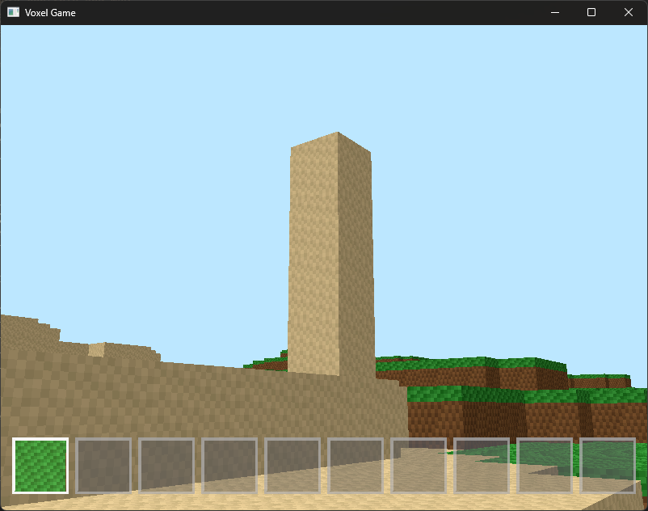

# RustCraft

A Minecraft-like voxel game built in Rust using wgpu graphics library. Features chunk-based terrain generation, block breaking/placing mechanics, real-time lighting, and physics-based movement.

